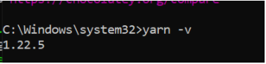

# Instalação Linux

## Para instalar o nvm, node e npm utilizando o linux abra o terminal e execute os seguintes comandos:

### NVM:

```bash
curl -o- https://raw.githubusercontent.com/nvm-sh/nvm/v0.37.2/install.sh | bash
```

```bash
wget -qO- https://raw.githubusercontent.com/nvm-sh/nvm/v0.37.2/install.sh | bash
```

```bash
export NVM_DIR="$([ -z "${XDG_CONFIG_HOME-}" ] && printf %s "${HOME}/.nvm" || printf %s "${XDG_CONFIG_HOME}/nvm")"
[ -s "$NVM_DIR/nvm.sh" ] && \. "$NVM_DIR/nvm.sh" # This loads nvm
```

> Para verificar a instação basta rodar o seguinte comando no terminal: `command -v nvm`

### NODE & NPM:

```base
nvm install 14.15.1 # LTS VERSION
```

```bash
nvm use 14.15.1
```

Para verificar a instalação basta executar os seguintes comandos no terminal:

```bash
node -v
# v14.15.1
npm -v
# 6.14.8
``` 

Instalando o Yarn:

```bash
npm install -g yarn
```

#

## Executando o Projeto:

Utilizando Yarn:

```bash
yarn install
```

Iniciando o servidor de desenvolvimento:

```bash
yarn start
```


# Instalação Windows


> #### Para Clonar o projeto em sua área de trabalho é necessário instalar o git
>
> - instalação do git
>

-Acesse [Git Download Page](https://git-scm.com/downloads)

-Escolha o sistema operacional windows, o download sera iniciado automaticamente.

-Abra o arquivo baixado e inicie as configurações, por padrão as configurações essenciais já vem marcadas
pode usar o padrão next, next, finish.

-Abra o terminal e digite: git --version
se a instalação tiver sido bem sucedida ira mostrar a versão atual do git em sua máquina.

-adicione suas configurações pessoais de usuario, *lembre-se de adicionar seu e-mail corporativo.*

```git config --global user.name "João Silva"```
```git config --global user.email "exemplo@ciandt.com"```

Instalação Concluída!
Agora você já pode clonar o projeto em sua máquina

Acesse o github na área do projeto:

rode os seguintes comandos no cmd
**lembre-se de estar localizado na pasta em que vc deseja que sejam importados os projetos**

**para o Front-end**
```git clone https://github.com/Fabianolv/safira-frontend```

**para o back-end**
```git clone https://github.com/andreullecit/sistema-safira```

Pronto, agora você já tem os projetos em sua máquina.


### 2- **Instalação do node.js**

Acesse    [Página de download do node.js](https://nodejs.org/en/download/)

-Escolha o sistema operacional, o download deve iniciar automaticamente 

-abra o arquivo baixado

Next, next, finish.


### 3- INSTALAÇÃO YARN

no terminal

```npm install -g yarn```


Após a instalação verifique:

```yarn -v```




*Prontinho, instalação concluída!*


### Rodar o projeto


Certifique-se de estar na pasta raiz do projeto **\safira-frontend**, para executar os comandos a seguir

Instalando dependências do projeto
```yarn install```

iniciando o projeto 
```yarn start```


