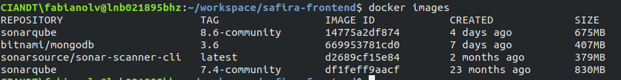
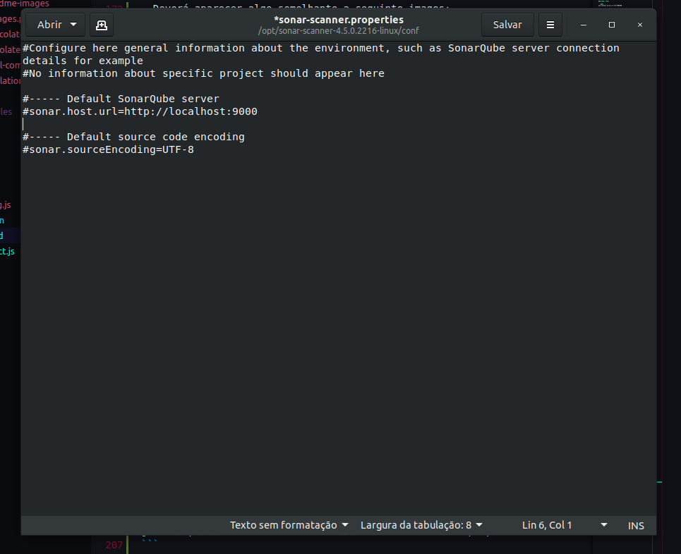
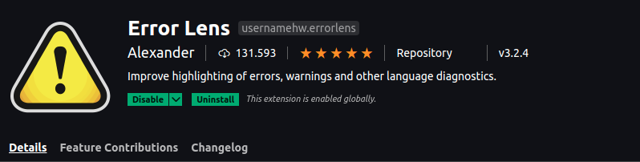
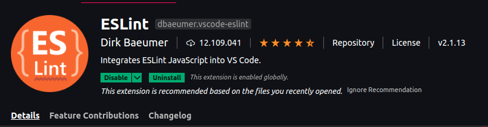
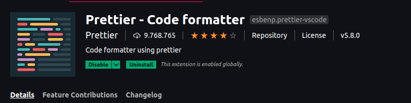

# Instalação Linux

## Para instalar o nvm, node e npm utilizando o linux abra o terminal e execute os seguintes comandos:

### NVM:

```bash
curl -o- https://raw.githubusercontent.com/nvm-sh/nvm/v0.37.2/install.sh | bash
```

```bash
wget -qO- https://raw.githubusercontent.com/nvm-sh/nvm/v0.37.2/install.sh | bash
```

```bash
export NVM_DIR="$([ -z "${XDG_CONFIG_HOME-}" ] && printf %s "${HOME}/.nvm" || printf %s "${XDG_CONFIG_HOME}/nvm")"
[ -s "$NVM_DIR/nvm.sh" ] && \. "$NVM_DIR/nvm.sh" # This loads nvm
```

> Para verificar a instação basta rodar o seguinte comando no terminal: `command -v nvm`

### NODE & NPM:

```base
nvm install 14.15.1 # LTS VERSION
```

```bash
nvm use 14.15.1
```

Para verificar a instalação basta executar os seguintes comandos no terminal:

```bash
node -v
# v14.15.1
npm -v
# 6.14.8
```

Instalando o Yarn:

```bash
npm install -g yarn
```

#

## Executando o Projeto:

Utilizando Yarn:

```bash
yarn install
```

Iniciando o servidor de desenvolvimento:

```bash
yarn start
```

# Instalação Windows

> #### Para Clonar o projeto em sua área de trabalho é necessário instalar o git
>
> - instalação do git

-Acesse [Git Download Page](https://git-scm.com/downloads)

-Escolha o sistema operacional windows, o download sera iniciado automaticamente.

-Abra o arquivo baixado e inicie as configurações, por padrão as configurações essenciais já vem marcadas
pode usar o padrão next, next, finish.

-Abra o terminal e digite: git --version
se a instalação tiver sido bem sucedida ira mostrar a versão atual do git em sua máquina.

-adicione suas configurações pessoais de usuario, _lembre-se de adicionar seu e-mail corporativo._

`git config --global user.name "João Silva"`
`git config --global user.email "exemplo@ciandt.com"`

Instalação Concluída!
Agora você já pode clonar o projeto em sua máquina

Acesse o github na área do projeto:

rode os seguintes comandos no cmd
**lembre-se de estar localizado na pasta em que vc deseja que sejam importados os projetos**

**para o Front-end**
`git clone https://github.com/Fabianolv/safira-frontend`

**para o back-end**
`git clone https://github.com/andreullecit/sistema-safira`

Pronto, agora você já tem os projetos em sua máquina.

### 2- **Instalação do node.js**

Acesse [Página de download do node.js](https://nodejs.org/en/download/)

-Escolha o sistema operacional, o download deve iniciar automaticamente

-abra o arquivo baixado

Next, next, finish.

### 3- INSTALAÇÃO YARN

no terminal

`npm install -g yarn`

Após a instalação verifique:

`yarn -v`


_Prontinho, instalação concluída!_

### Rodar o projeto

Certifique-se de estar na pasta raiz do projeto **\safira-frontend**, para executar os comandos a seguir

Instalando dependências do projeto
`yarn install`

iniciando o projeto
`yarn start`

# UTILIZANDO SONAR-QUBE NO LINUX

- No projeto do spring-boot executar o comando:

```bash
docker-compose up -d
```

- Intalar o sonar-scanner seguindo o tutorial presente no sonarqube para analisar o projeto.

## Instalação por Docker:

- Executar:

```bash
docker pull sonarsource/sonar-scanner-cli
```

- Em seguida executar o seguinte comando:

```bash
docker images
```

- Deverá aparecer algo semelhante a seguinte images:



- Em seguida copie o IMAGE ID do **sonarsource/sonar-scanner-cli** e execute o seguinte comando:

```bash
docker run -i -t ${YOUR IMAGE ID}
```

## Instalação por arquivo zip:

- Ao executar o sonarqube e iniciar um projeto novo no sonar, fazer o download do arquivo zip presente no link disponível e em seguida executar os seguintes comandos:

```bash
unzip ${nome-do-seu-arquivo}.zip
sudo mv ${nome-do-seu-diretório}/ /opt/
```

- Em seguida adicionar o scanner no seu PATH seguinte as instruções:

```bash
gedit ~/.bashrc
```

- Vá até o final do arquivo e adicione na ultima linha:

```bash
export PATH=$PATH/opt/${nome-do-seu-diretorio}/bin/
```

- Em seguida execute o comando:

```bash
gedit /opt/${nome-do-seu-diretório}/conf/sonar-scanner.properties
```

- Irá aparecer algo semelhante a isso:



- Agora basta descomentar as linhas

```conf
sonar.host.url=http://localhost:900
# E A LINHA
sonar.sourceEnconding=UTF-8
```

# EXECUTANDO O SONAR-SCANNER

- Para executar o scanner basta utilizar o comando que ira aparecer em sua tela no sonar-qube ou adicionar o token gerado dentro do arquivo sonar-project.js e executar o comando:

```bash
yarn sonar
```

# Extenções para VSCODE

[](https://marketplace.visualstudio.com/items?itemName=usernamehw.errorlens)

[](https://marketplace.visualstudio.com/items?itemName=dbaeumer.vscode-eslint)

[](https://marketplace.visualstudio.com/items?itemName=esbenp.prettier-vscode)
